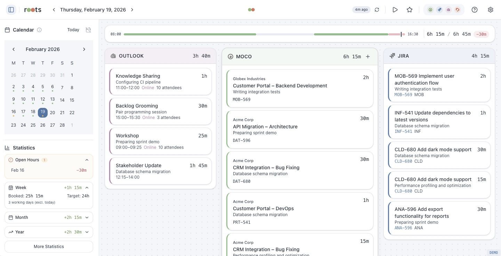

<p align="center">
  <picture>
    <source media="(prefers-color-scheme: dark)" srcset="docs/images/roots-logo-dark.svg" />
    
  </picture>
</p>

<p align="center">
  <strong>Unified work time overview across Moco, Jira, Outlook and Personio</strong>
</p>

<p align="center">
  
  
  
  
</p>

---

Roots aggregates your work time from multiple services into a single desktop app. It pulls data from Moco, Jira, Outlook and Personio, then reconciles and displays everything in a unified timeline.



## Features

- **Multi-Service Integration** - Connect Moco, Jira (Cloud & Server), Outlook and Personio
- **Unified Timeline** - Day, week and month views across all services
- **Reconciliation** - Confidence-based matching and comparison between services
- **Personio Sync** - Automatic work schedule and absence import
- **Native Desktop App** - Lightweight Tauri app, no browser CORS issues
- **Dark Mode** - Light and dark theme support

## Installation

### Homebrew (recommended)

```bash
brew tap konradmichalik/tap
brew install --cask roots
```

Updates via `brew upgrade --cask roots`.

### Manual Download

Download the latest `.dmg` from [GitHub Releases](https://github.com/konradmichalik/roots/releases).

> The app is currently unsigned. On first launch: right-click the app and select "Open", or run `xattr -cr /Applications/Roots.app`.

## Development

```bash
git clone https://github.com/konradmichalik/roots.git
cd roots
npm install
```

### Browser Mode

```bash
# Start the CORS proxy (required for browser mode)
cd proxy && npm install && node server.js &

# Start the dev server
npm run dev
```

### Desktop Mode

```bash
npm run tauri:dev
```

### Requirements

- Node.js 18+
- Rust toolchain (for Tauri builds)
- One or more of: Moco, Jira, Outlook, Personio account

## Supported Services

| Service | Auth Method | Provides |
|---------|------------|----------|
| **Moco** | API Key | Time entries, projects, presences |
| **Jira Cloud** | Email + API Token | Worklogs |
| **Jira Server** | Username/Password or PAT | Worklogs |
| **Outlook** | OAuth2 | Calendar events |
| **Personio** | Client ID + Secret | Absences, work schedule |

## Tech Stack

- **[Svelte 5](https://svelte.dev/)** with TypeScript and Runes
- **[Tauri 2](https://tauri.app/)** for native desktop runtime
- **[Tailwind CSS v4](https://tailwindcss.com/)** for styling
- **[shadcn-svelte](https://www.shadcn-svelte.com/)** UI components

## Scripts

| Command | Description |
|---------|------------|
| `npm run dev` | Start Vite dev server |
| `npm run build` | Production build |
| `npm run tauri:dev` | Desktop app development |
| `npm run tauri:build` | Build native app bundle |
| `npm run check` | TypeScript type checking |
| `npm run lint` | ESLint check |
| `npm run format` | Prettier formatting |
| `npm run release` | Bump version, tag and push |

## License

MIT
