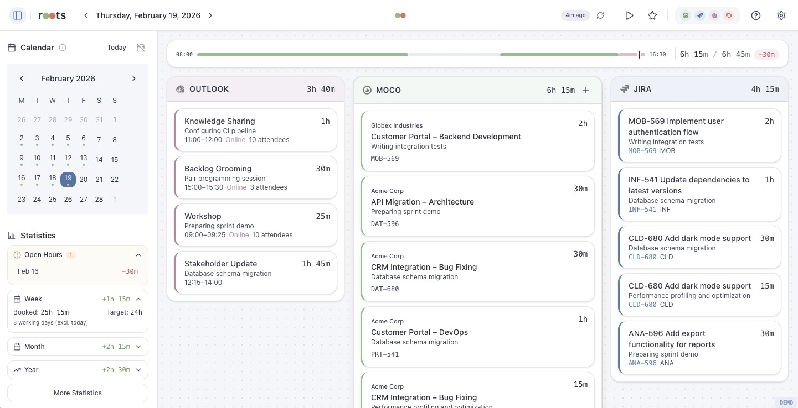

<p align="center">
  <picture>
    <source media="(prefers-color-scheme: dark)" srcset="docs/images/roots-logo-dark.svg" />
    
  </picture>
</p>

<p align="center">
  <strong>Unified work time overview across Moco, Jira, Outlook and Personio</strong>
</p>

<p align="center">
  <a href="https://konradmichalik.github.io/roots/"></a>
  
  
  
  
  
</p>

---

Roots aggregates your work time from multiple services into a single desktop app. It pulls data from Moco, Jira, Outlook and Personio, then reconciles and displays everything in a unified timeline — so you always know where your hours went.



## ✨ Features

- **Multi-Service Integration** — Connect Moco, Jira (Cloud & Server), Outlook and Personio
- **Unified Timeline** — Day, week and month views across all connected services
- **Confidence-Based Reconciliation** — Automatic matching and comparison between services
- **Smart Booking Suggestions** — Suggests Moco project + task based on recent booking history when creating entries from Jira worklogs or Outlook events
- **Personio Sync** — Work schedule and absence import with automatic weekday-hours update
- **Native Desktop App** — Lightweight Tauri 2 app; no browser CORS issues
- **Dark / Light Mode** — Nord-palette design tokens with full theme support

## 🔥 Installation

### Homebrew (recommended)

```bash
brew tap konradmichalik/tap
brew install --cask roots
```

Update to the latest version:

```bash
brew update && brew upgrade --cask roots
```

### Manual Download

Download the latest `.dmg` from [GitHub Releases](https://github.com/konradmichalik/roots/releases).

> [!WARNING]
> The app is currently unsigned. On first launch, right-click the app and select **Open**, or run `xattr -cr /Applications/Roots.app` in your terminal.

## 🚀 Getting Started

Connect at least one service in **Settings → Connections** to start seeing entries. Each service requires different credentials:

| Service | Auth Method | Provides |
|---------|-------------|----------|
| **Moco** | API Key | Time entries, projects, presences |
| **Jira Cloud** | Email + API Token | Worklogs |
| **Jira Server** | Username/Password or PAT | Worklogs |
| **Outlook** | OAuth2 | Calendar events |
| **Personio** | Client ID + Secret | Absences, work schedule |

> [!NOTE]
> Personio does not provide time entries. When connected, it automatically updates your weekday-hours target from your work schedule and disables manual absence editing.

## 🧑‍💻 Contributing

### Prerequisites

- Node.js 18+
- Rust toolchain (required for Tauri builds)
- At least one service account (Moco, Jira, Outlook, or Personio)

### Setup

```bash
git clone https://github.com/konradmichalik/roots.git
cd roots
npm install
```

### Development Modes

**Browser mode** — fastest iteration, no Rust compilation:

```bash
# Terminal 1 — CORS proxy (required)
cd proxy && npm install && node server.js

# Terminal 2 — Vite dev server
npm run dev
```

> [!TIP]
> Use browser mode for UI development. The CORS proxy runs on `localhost:3002` and forwards requests to external services.

**Desktop mode** — full Tauri app with native features:

```bash
npm run tauri:dev
```

### Scripts

| Command | Description |
|---------|-------------|
| `npm run dev` | Vite dev server (browser mode) |
| `npm run build` | Production build |
| `npm run tauri:dev` | Desktop app development |
| `npm run tauri:build` | Build native app bundle |
| `npm run check` | Svelte check + TypeScript |
| `npm run lint` | ESLint |
| `npm run lint:fix` | ESLint with auto-fix |
| `npm run format` | Prettier |
| `npm run release` | Bump version, sync Tauri config, tag and push |

## ⚙️ Tech Stack

| Layer | Technology |
|-------|------------|
| UI Framework | [Svelte 5](https://svelte.dev/) with Runes + TypeScript |
| Desktop Runtime | [Tauri 2](https://tauri.app/) (Rust) |
| Styling | [Tailwind CSS v4](https://tailwindcss.com/) + Nord palette design tokens |
| UI Components | [shadcn-svelte](https://www.shadcn-svelte.com/) + [bits-ui](https://bits-ui.com/) |
| Validation | [Zod](https://zod.dev/) for all API response schemas |

## 📜 License

MIT
